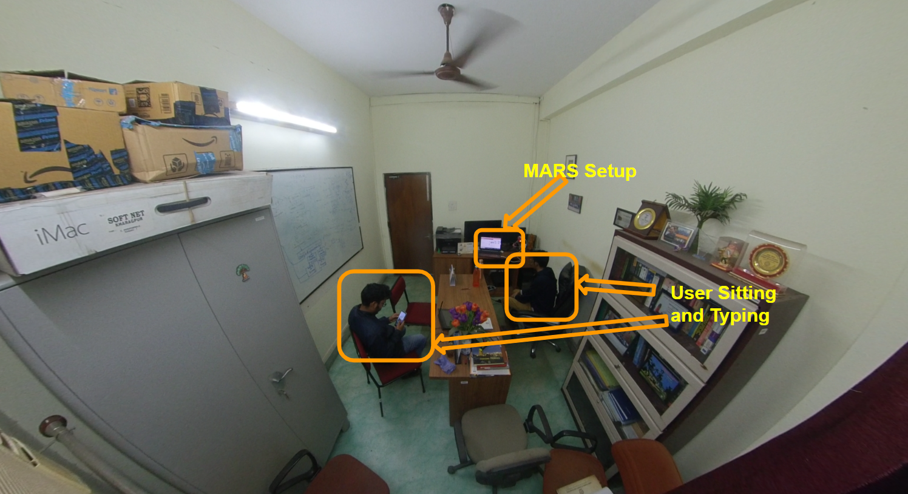
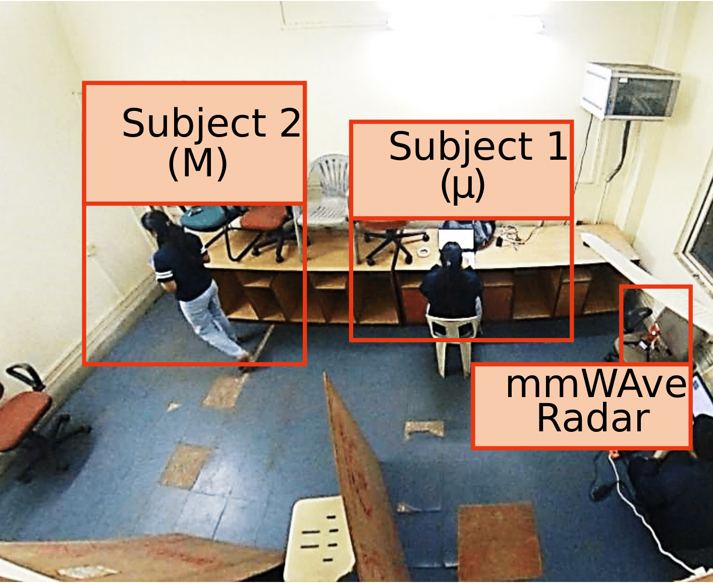
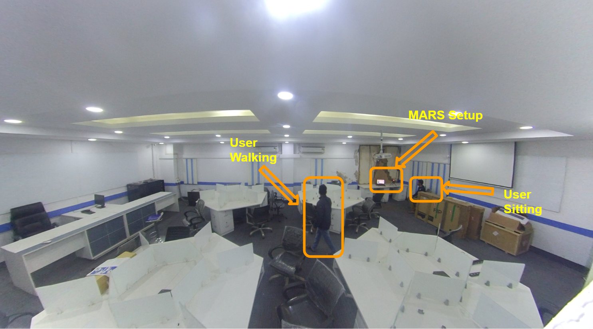

## Different Room Setup

Below we detail:
- the experimental setup for different room experiments 
    * R1:office-cabin(4mx3m) 
    * R2:study-room(5mx8m) 
    * R3:laboratory(12mx6.5m)
- different obstacles such as 
    * wooden-chairs
    * tables
    * metal-wardrobes
    * fiber-desks
    * desktop-computers
- users performing macro-micro activities together etc.

### R1 Setup:

### R2 Setup:

### R3 Setup:

